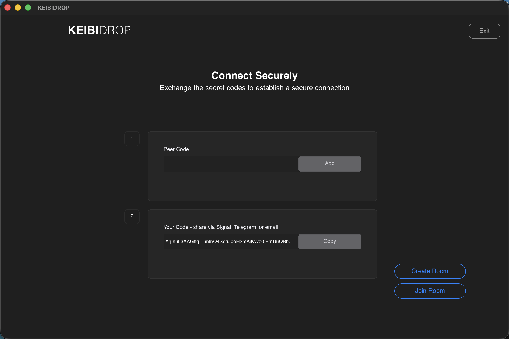
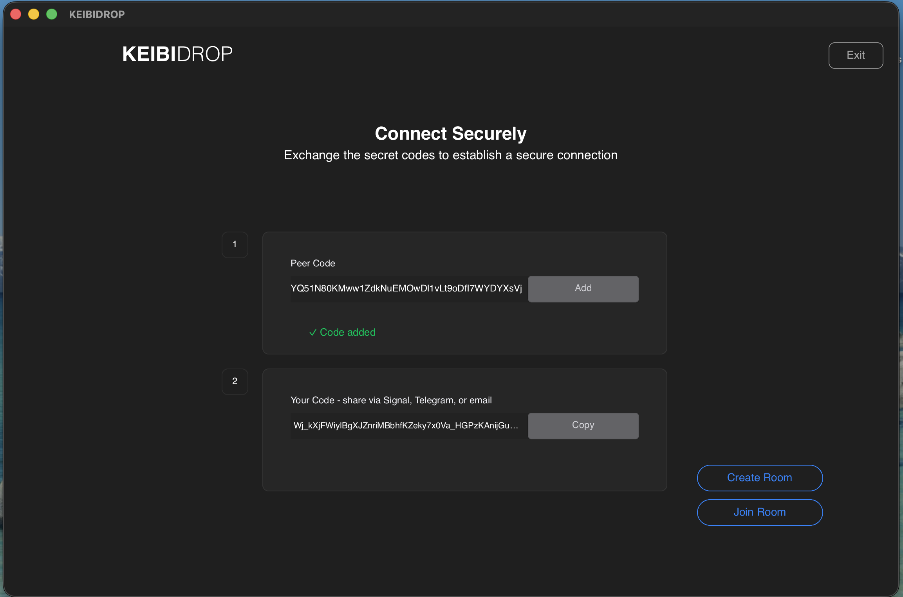
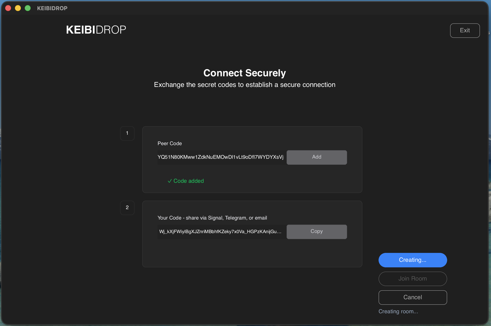
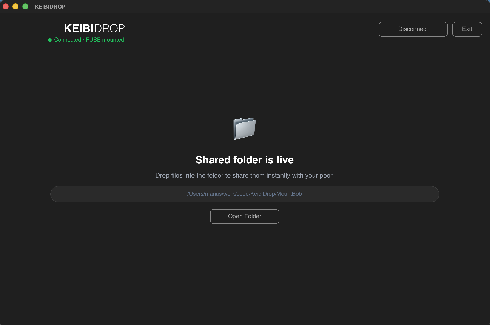
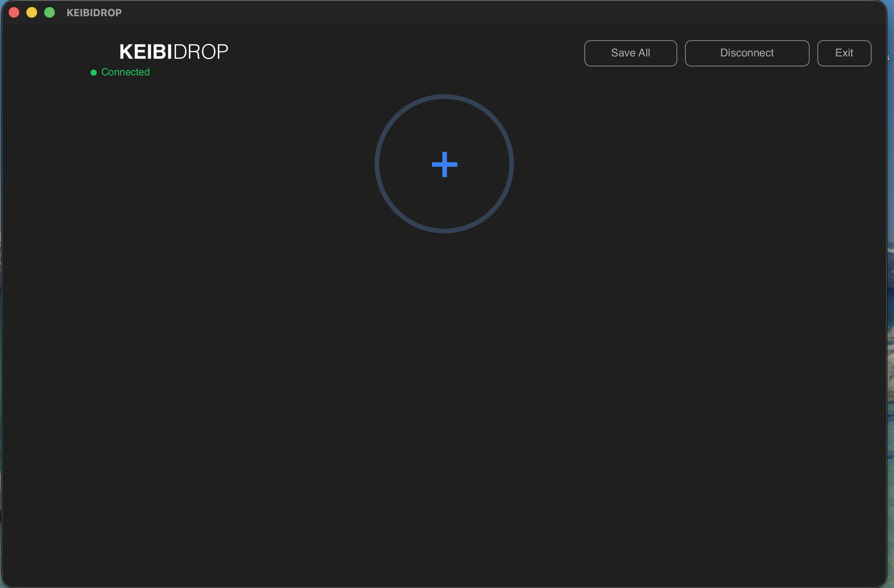
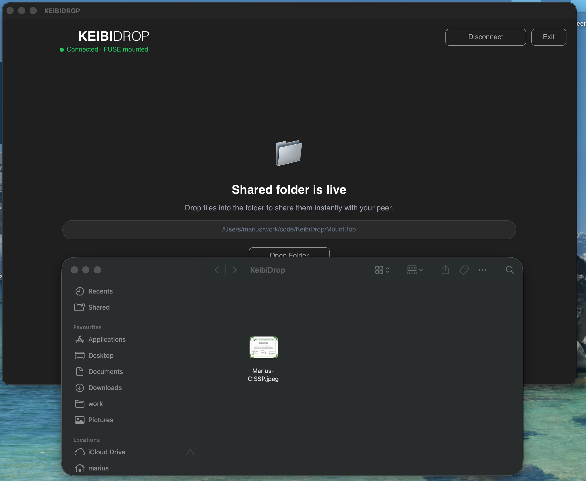
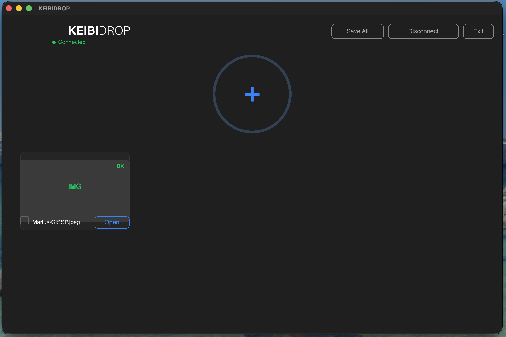
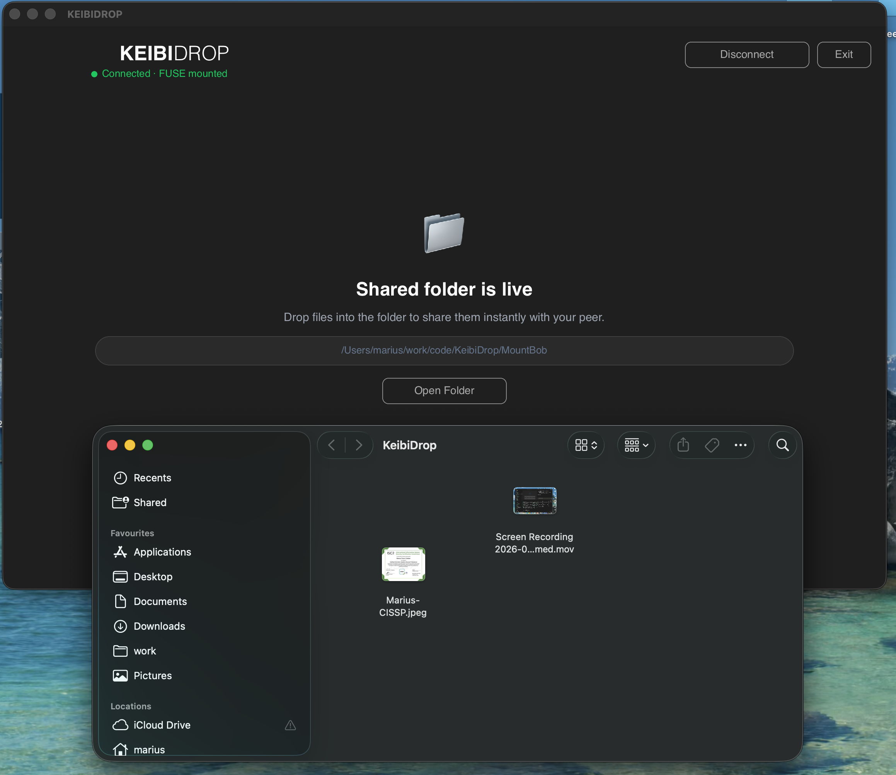
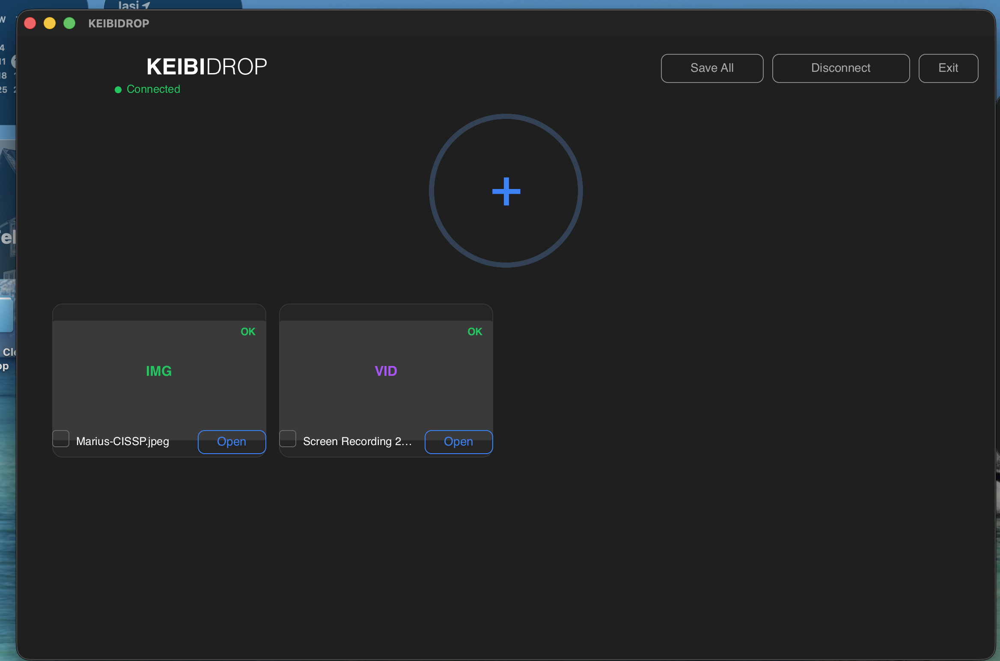

```text
██╗  ██╗███████╗██╗██████╗ ██╗██████╗ ██████╗  ██████╗ ██████╗ 
██║ ██╔╝██╔════╝██║██╔══██╗██║██╔══██╗██╔══██╗██╔═══██╗██╔══██╗
█████╔╝ █████╗  ██║██████╔╝██║██║  ██║██████╔╝██║   ██║██████╔╝
██╔═██╗ ██╔══╝  ██║██╔══██╗██║██║  ██║██╔══██╗██║   ██║██╔═══╝ 
██║  ██╗███████╗██║██████╔╝██║██████╔╝██║  ██║╚██████╔╝██║     
╚═╝  ╚═╝╚══════╝╚═╝╚═════╝ ╚═╝╚═════╝ ╚═╝  ╚═╝ ╚═════╝ ╚═╝     
```

# KeibiDrop - Share files between desktops

KeibiDrop is a synchronous file transfer tool for direct peer-to-peer exchange over untrusted networks.
Although traffic is fully end-to-end encrypted, your IP is visible to the peer and the relay. If they’re hostile, they know where to send packets. Or drones. Or worse: ~lawyers~ marketing ads.

> In simple terms: "Dropbox" your files in real time between your desktop devices without uploading to a server.

It uses modern post-quantum cryptography (ML-KEM + X25519) and symmetric encryption (ChaCha20-Poly1305) to ensure that only the intended recipient can decrypt the file.

The sender and receiver perform a secure key exchange via a short-lived relay server, after which all communication is encrypted end-to-end.

> In simple terms (again): The recipients generate some public keys; they upload it to my relay; they share with each-other the long and hideous hash of their public keys, via any chat app (or written medium). The hash is used to retrieve the keys and establish the connection. (Ok, maybe I lied, the terms are not so simple :< )

> In even simpler terms: Share with your peer the "long password" via chat and start sharing files.

### How it works

**Step 1** — Both peers start KeibiDrop. Copy your code and send it to your peer via Signal, Telegram, or any chat.

| Peer A (fresh) | Peer B (code exchanged) |
|---|---|
|  |  |

**Step 2** — Paste each other's codes, then Create Room / Join Room. Connection establishes automatically.

| Creating room... |
|---|
|  |

**Step 3** — Connected! Share files in real time.

| FUSE mode (virtual folder in Finder) | No-FUSE mode (drag & drop UI) |
|---|---|
|  |  |

**Step 4** — Peer drags a file in. It appears instantly on the other side.

| Image arrives in FUSE folder (Finder) | Image received in no-FUSE UI |
|---|---|
|  |  |

**Step 5** — Share more files, including video. Open directly from the UI or FUSE mount.

| Image + video in FUSE folder | Image + video in no-FUSE UI |
|---|---|
|  |  |

---

## Disclaimer

We used **GPT-4o (in Monday mode)** for dopamine kicks, memes, and to generate some code and docs.

We gained the knowledge in this space without relying on ~AI~ sycophancy.

The first version has some red flags:
1. There is no file transfer resume on lost connection.
2. Private keys and session keys are stored in memory (no TPM/secure enclave integration yet).

Thus treat it as a functional demo. We plan to maintain it and improve it as resources permit.

> Re-reading all this word soup in the README, makes me think about writing novels inside a code project, where the foot notes live inside the git commit message, the comments provide the narrators voice, and the code the action flow.

### Important

Anonymity breeds unaccountability, thus it is easy to do bad things and hurt people, only use this tool with recipients you know, as otherwise any files that you transfer might harm you and those around you.

The idea of this tool is to allow you to be anonymous to third parties. In theory there is no need for the relay server for the key-exchange and establishing the session, but I did not implement it "that way" in order to reduce the payload shared out-of-band, and because I am curious how many people are using the service through the relay. I might add it in the future if there is interest.

---

## Inspiration

This project was loosely inspired by:

- [croc](https://github.com/schollz/croc) - for its clean approach to secure, peer-to-peer transfers
- [rclone](https://rclone.org/) - for the general concept of mapping cloud storage to local workflows

I haven’t used these tools directly, but I liked the ideas they explored and wanted to build something in that direction, using my own design and implementation.

---

## Features

- Post-quantum hybrid key exchange using ML-KEM-1024 and X25519
- ChaCha20-Poly1305 symmetric encryption
- Deterministic fingerprint verification
- No persistent metadata or tracking
- Designed for use over untrusted relays
- Relay privacy - the relay sees only encrypted blobs, not your metadata
- Session re-keying for forward secrecy during long transfers
- Mountable filesystem with data transfer on access

---

## Known Limitations

### File Sharing Behavior

- **Deletions don't propagate**: When a peer deletes a file they're sharing, your local copy (if downloaded) is preserved. The file simply disappears from the shared view.

- **Partial downloads on unshare**: If you're reading a file with offset (e.g., tailing a remote log) and the peer stops sharing, only the bytes you've already read are saved locally. The file may be incomplete/sparse.

- **Selective mmap support**: Per-file `direct_io` is used for write operations (for real-time sync) but disabled for `.git/` directories (to allow mmap for git pack files). See [DD-002](docs/DesignDecisions.md#dd-002-per-file-directio-for-mmapcache-compatibility).

- **Symlinks not implemented**: Symlink operations return ENOSYS.

### POSIX Compliance

After running pjdfstest, specific unsupported operations will be documented here.

---

## ⚠️ Requirements

- **All platforms**: [go 1.24](tip.golang.org/doc/go1.24)
- **All platforms**: Requires `cgo` (due to `cgofuse` from WinFsp)

- **macOS**: [macFUSE](https://macfuse.github.io/)
- **Windows**: [WinFsp](https://winfsp.dev/)
- **Linux**: fuse3 (usually preinstalled)

### macOS: Enable `allow_other` for Finder/Preview access

On macOS, sandboxed apps like Finder and Preview cannot access FUSE mounts unless `allow_other` is enabled. Without this, you'll get "you don't have permission to view it" errors when opening files directly from the mount.

**One-time setup:**
```bash
sudo sh -c 'echo "user_allow_other" > /etc/fuse.conf'
```

This creates `/etc/fuse.conf` with the `user_allow_other` option, which allows non-root users to use the `allow_other` mount flag. No reboot required - just remount the filesystem.


---

## ⚠️ Networking Requirements

KeibiDrop uses **direct P2P communication over IPv6**. (Mainly because I did not want to bother with STUN/TURN servers.)

### In order for a session to connect successfully:

- Both peers must have **globally routable IPv6 addresses**.
- Both peers must be able to **accept inbound TCP connections** on the advertised port.
- **Firewalls must allow these inbound connections**. (Check your router and OS firewall.)
- **NAT traversal is not supported** - KeibiDrop does **not** use STUN, TURN, or UPnP.

> If your system is not reachable via IPv6, KeibiDrop will not work.  
> You can test your IPv6 connectivity at: [https://test-ipv6.com](https://test-ipv6.com)

This approach avoids leaking IP metadata to third-party STUN servers, aligning with KeibiDrop’s privacy-first design. However, this also limits compatibility in restrictive or NATed IPv4-only networks.

---

## Repository Structure

```md
cmd/ # Main entry point
pkg/crypto/ # Cryptographic primitives
pkg/filesystem # FUSE filesystem
go.mod # Module definition
go.sum # Dependencies
Security.md # Protocol-level cryptographic design
```

---

## Setup & Build

Requires **Go 1.24.3+**, **Rust toolchain**, and **CGO enabled**. On macOS, Apple's `clang` must be the C compiler (`go env CC` should show `clang`, not `gcc`).

For the full setup guide (prerequisites, troubleshooting, environment variables), see **[SETUP.md](./SETUP.md)**.

Quick build (Rust UI):

```bash
make build-static-rust-bridge
cd rust && cargo build --release
```

---

## Test

```bash
go test ./pkg/...
```

---

## Cryptographic Summary

- **Asymmetric Key Exchange**: ML-KEM-1024 (Kyber) + X25519
- **Symmetric Encryption**: ChaCha20-Poly1305
- **Key Derivation**: HKDF over shared secrets
- **Streaming Mode**: Encrypted chunked transfer with per-chunk AEAD

See [`Security.md`](./Security.md) for a complete protocol overview.

---

## Contributing & Legal

Want to contribute? Great, but please read the [CONTRIBUTING.md](./CONTRIBUTING.md) first. All commits must be signed (`git commit -S`); you also need to `git commit --sign-off` in order to agree to the terms outlined in our [Developer Certificate of Origin](./DCO.txt).

For information about how we (don’t) use your data, see the [Privacy Policy](./privacy.md).

---

## LICENSE

This project is licensed under the Mozilla Public License 2.0.

See the [LICENSE](./LICENSE) file for details.

This release is the community edition.

---

### Enterprise Edition Available

This project is developed and maintained as Free and Open Source Software (FOSS) under the MPL 2.0 license.

I plan for an Enterprise Edition that will include:

- Additional features not found in the open-source version
- Commercial support and onboarding assistance
- Customization services to fit specific business needs

Commercial licensing and support will be available at [keibisoft.com](https://keibisoft.com/tools/keibidrop.html)
