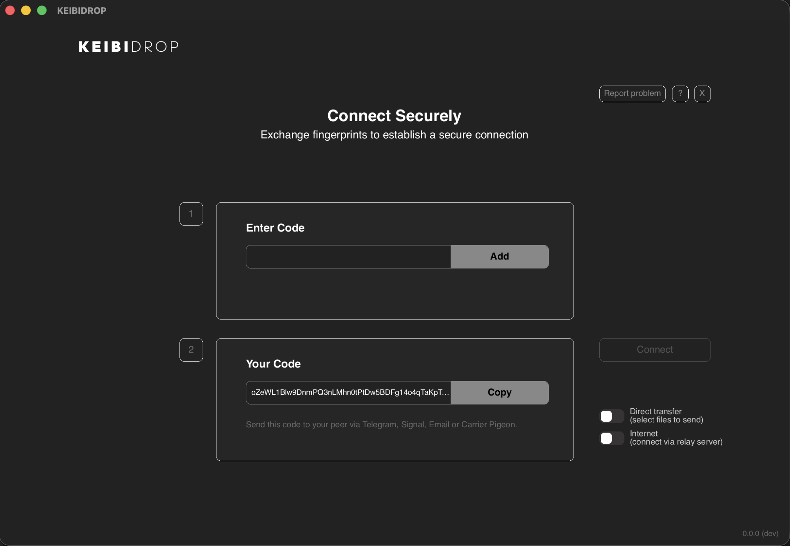
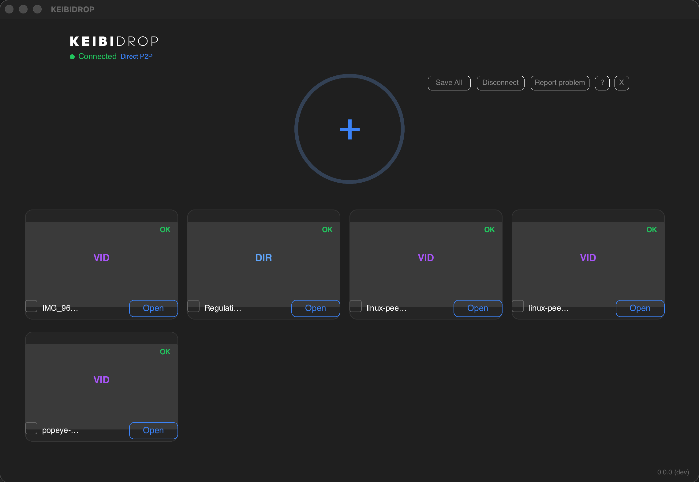
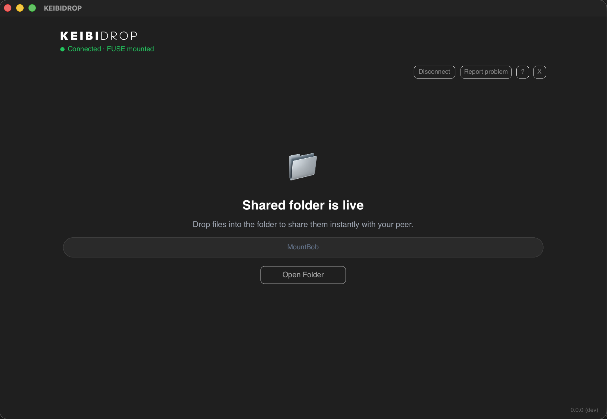
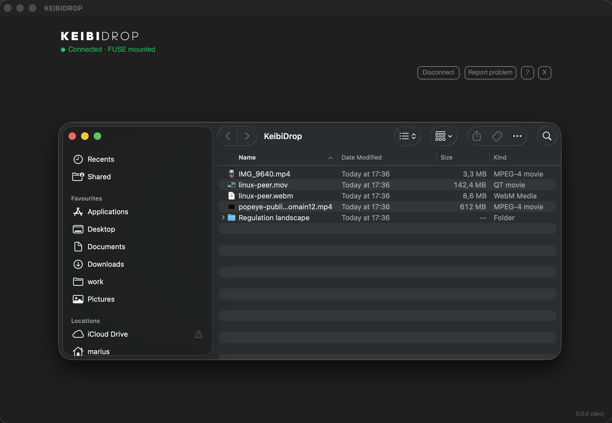
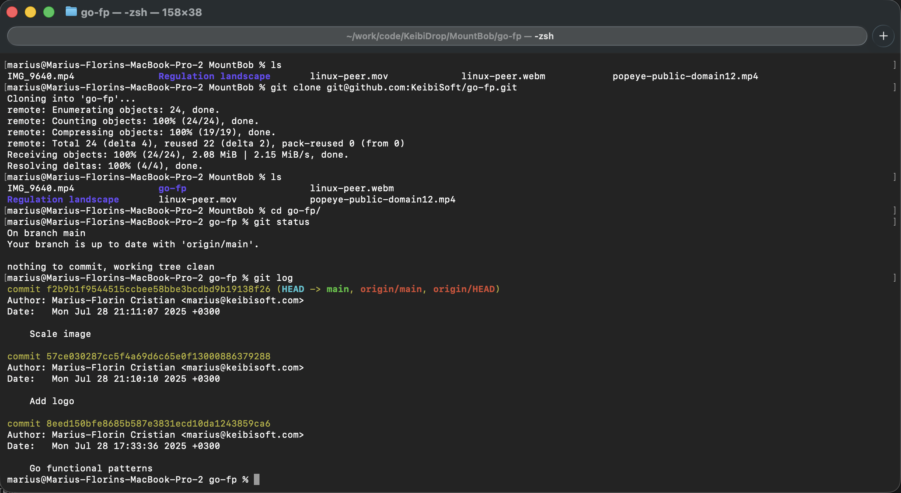

<p align="center">
  <picture>
    <source media="(prefers-color-scheme: dark)" srcset="logo.svg">
    <source media="(prefers-color-scheme: light)" srcset="logo-dark.svg">
    
  </picture>
</p>

<p align="center">
  <a href="https://keibidrop.com">Website</a> · <a href="https://github.com/KeibiSoft/KeibiDrop/releases">Download</a> · <a href="https://keibisoft.com/blog.html">Blog</a>
</p>

Share files between devices. They show up as a folder on your computer.

- End-to-end encrypted (post-quantum). The relay cannot read your files.
- On the same network, devices find each other automatically. One click to connect.
- Over the internet, exchange fingerprints once. Save contacts for future sessions.
- Peer files appear as a native folder (FUSE). Open, edit, git clone, anything.
- Works through firewalls. Automatic fallback to an encrypted relay.
- macOS, Linux, Windows. iOS and Android coming soon.
- Open source (MPL-2.0).

<p align="center">
  
</p>

| Direct Transfer | Virtual Folder (FUSE) |
|:---:|:---:|
|  |  |
| Drag files in. Your peer saves what they need. | Peer files appear as a folder. Open in any app. |

| Finder | Terminal (git) |
|:---:|:---:|
|  |  |

---

## Install

### macOS

```bash
brew tap keibisoft/keibidrop
brew install keibidrop
```

### Linux (Debian/Ubuntu)

```bash
wget https://github.com/KeibiSoft/KeibiDrop/releases/latest/download/keibidrop_amd64.deb
sudo dpkg -i keibidrop_amd64.deb
```

### Windows

```bash
choco install keibidrop
```

Or download from [GitHub Releases](https://github.com/KeibiSoft/KeibiDrop/releases).

### Build from source

```bash
git clone https://github.com/KeibiSoft/KeibiDrop.git
cd KeibiDrop
make build-kd       # CLI daemon
make build-cli      # Interactive CLI
make build-rust     # Desktop UI (needs Rust + Slint)
```

---

## Quick start

**Same network (LAN):**
1. Both peers launch KeibiDrop
2. Devices discover each other automatically
3. One click to connect
4. Share files

**Over the internet:**
1. Both peers launch KeibiDrop
2. Copy your fingerprint and send it to your peer (Signal, Telegram, anything)
3. Paste each other's fingerprints and connect
4. Share files

Save a peer as a contact to skip the fingerprint exchange next time. On the same network, saved contacts connect with one click using pseudonyms.

It works through firewalls automatically. If direct connection fails, KeibiDrop falls back to an encrypted relay. No port forwarding, no router configuration.

---

## Two modes

| | Direct Transfer | Virtual Folder (FUSE) |
|--|--|--|
| Speed | Up to 550 MB/s | Up to 250 MB/s |
| How it works | Add files, peer pulls them | Peer's files appear as a local folder |
| Setup | Nothing extra | Install [macFUSE](https://macfuse.github.io/), [fuse3](https://github.com/libfuse/libfuse), or [WinFsp](https://winfsp.dev/) |
| Best for | Sending large files | Working on shared files, git repos |

---

## How it works

1. Peers exchange fingerprints (or discover each other on LAN)
2. KeibiDrop finds the fastest path: LAN, direct IPv6, or encrypted relay
3. Files transfer over an encrypted channel the relay cannot read
4. Keys rotate automatically for forward secrecy

The encryption is post-quantum (ML-KEM-1024 + X25519) with AES-256-GCM or ChaCha20-Poly1305. Full protocol details in [Security.md](./Security.md).

---

<details>
<summary><strong>Three interfaces</strong></summary>

**Desktop UI** (Rust/Slint)
```bash
./keibidrop
```

**Interactive CLI** (terminal REPL)
```bash
./keibidrop-cli
```

**Agent CLI** (for scripts and AI agents, all output is JSON)
```bash
./kd start                           # Start daemon
./kd show fingerprint                # Get your fingerprint
./kd register <peer-fingerprint>     # Register peer
./kd create                          # Create room (or: kd join)
./kd add /path/to/file.zip           # Share a file
./kd list                            # List shared files
./kd pull file.zip ~/Downloads/      # Download a file
```

See [docs/kd-agent-guide.md](./docs/kd-agent-guide.md).

</details>

<details>
<summary><strong>Configuration</strong></summary>

KeibiDrop reads `~/.config/keibidrop/config.toml`. Environment variables override the config.

| Setting | Env var | Default |
|--|--|--|
| Relay server | `KD_RELAY` | `https://keibidroprelay.keibisoft.com/` |
| Bridge relay | `KD_BRIDGE` | `bridge.keibisoft.com:26600` |
| Save folder | `KD_SAVE_PATH` | `~/KeibiDrop/Received/` |
| FUSE mount | `KD_MOUNT_PATH` | `~/KeibiDrop/Mount/` |
| Inbound port | `KD_INBOUND_PORT` | 26431 |
| Disable FUSE | `KD_NO_FUSE` | false |

</details>

<details>
<summary><strong>Security</strong></summary>

Post-quantum hybrid key exchange prevents future quantum computers from decrypting recorded traffic. Forward secrecy via periodic re-keying limits exposure if a session key is ever compromised.

By default, identity is ephemeral: a fresh keypair each session, anonymous, unlinkable. For ease of use, you can save persistent identities encrypted with a per-install master key stored in the OS keychain (macOS Keychain Services, Linux Secret Service, Windows Credential Manager). Headless setups fall back to `~/.config/keibidrop/.master.key` (mode 0600). Optional passphrase protection via Argon2id for users who back up config to the cloud.

Full protocol description: [Security.md](./Security.md)

</details>

---

## Troubleshooting

See [TROUBLESHOOTING.md](./TROUBLESHOOTING.md).

## Contributing

See [CONTRIBUTING.md](./CONTRIBUTING.md).

## License

Go engine, CLI, and mobile bindings: [Mozilla Public License 2.0](./LICENSE) (per-file copyleft)

Rust UI and brand assets: Proprietary - see [DUAL-LICENSE.md](./DUAL-LICENSE.md)

Desktop UI built with [Slint](https://slint.dev)

Built by [KeibiSoft SRL](https://keibisoft.com).

---

## Links

- [Website](https://keibidrop.com)
- [Technical deep dive](https://keibisoft.com/tools/keibidrop.html)
- [Blog posts](https://keibisoft.com/blog.html) (22 posts on FUSE, crypto, performance)
- [FAQ](https://keibisoft.com/tools/keibidrop-faq.html)
- [Comparison with alternatives](https://keibisoft.com/tools/keibidrop-vs-alternatives.html)
