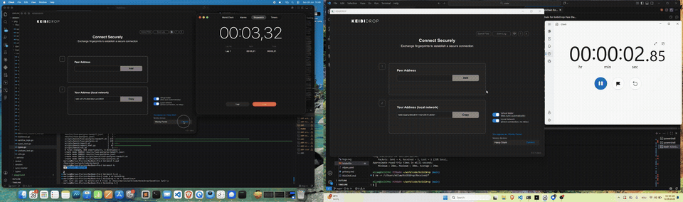
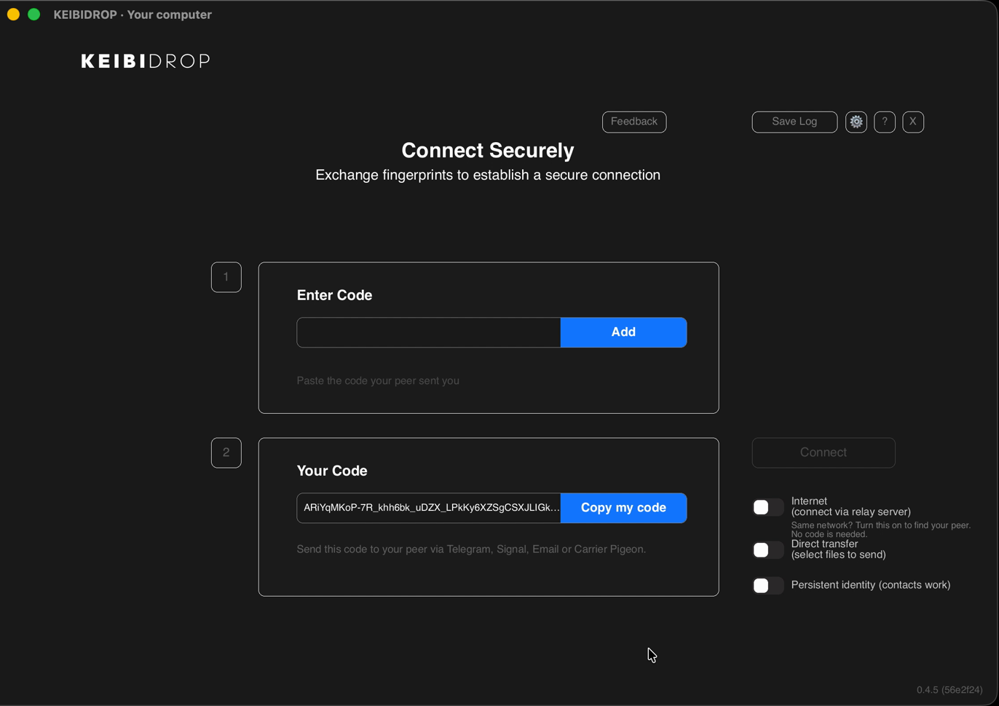
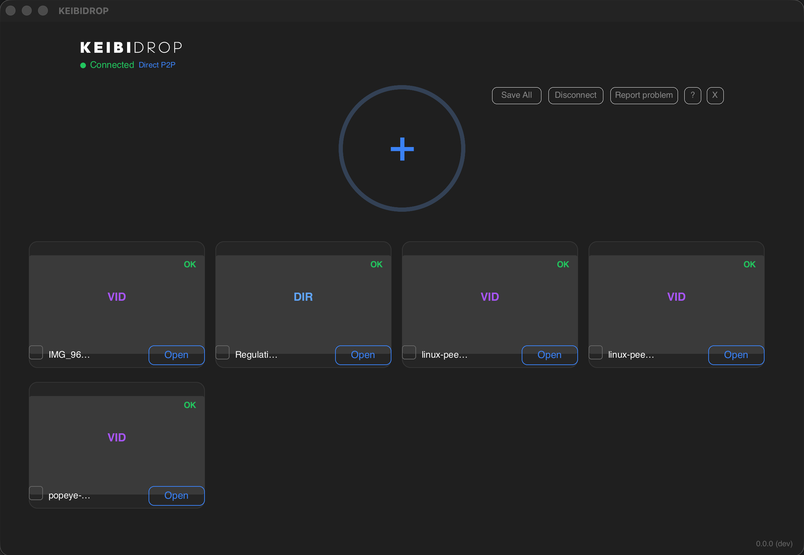
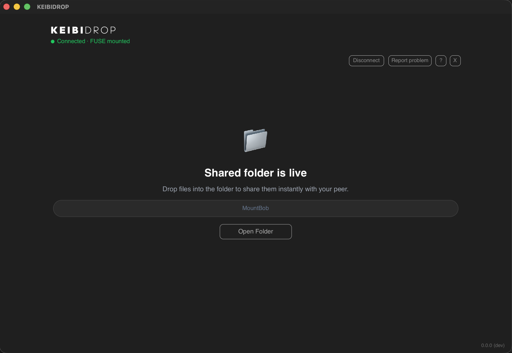
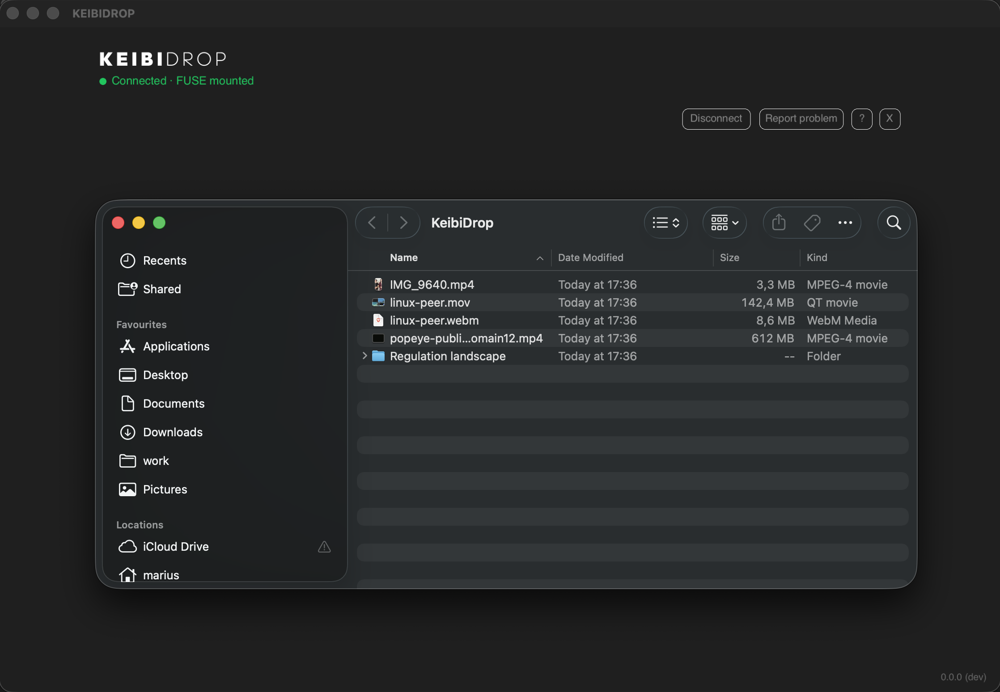
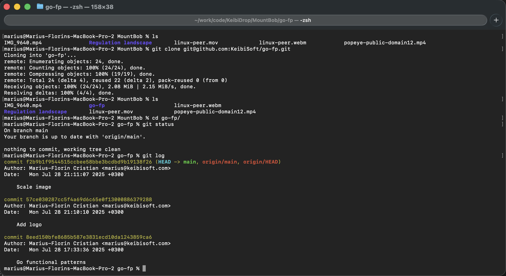

<p align="center">
  <picture>
    <source media="(prefers-color-scheme: dark)" srcset="logo.svg">
    <source media="(prefers-color-scheme: light)" srcset="logo-dark.svg">
    
  </picture>
</p>

<p align="center">
  <a href="https://keibidrop.com">Website</a> · <a href="https://github.com/KeibiSoft/KeibiDrop/releases">Download</a> · <a href="https://keibisoft.com/blog.html">Blog</a>
</p>

<h2 align="center">Work on shared files instantly.<br>No more upload or download waiting.</h2>

<p align="center">
  <a href="https://www.youtube.com/watch?v=9Wt0NMx2_I8">
    
  </a>
  <br><sub><b>Click to watch on YouTube</b> (with sound)</sub>
</p>

Another computer's files show up as a folder on yours. Open and edit them in your own apps, with nothing to download first.

- Open a 40 GB file and start working instantly. Your edits sync back.
- End-to-end encrypted (post-quantum). No cloud, and the relay never reads your files.
- Same network: one click. Over the internet: swap a code once, then save the contact.
- Their files become a real folder on your machine. Open, edit, `git clone`, anything.
- macOS, Linux, Windows, Android. iOS coming soon. Open source engine (MPL-2.0).

<p align="center">
  
</p>

| Direct Transfer | Virtual Folder (FUSE) |
|:---:|:---:|
|  |  |
| Drag files in. Your peer saves what they need. | Peer files appear as a folder. Open in any app. |

| Finder | Terminal (git) |
|:---:|:---:|
|  |  |

---

## Install

### macOS

```bash
brew tap keibisoft/keibidrop
brew trust keibisoft/keibidrop
brew install keibidrop
```

### Linux (Debian/Ubuntu)

```bash
wget -O keibidrop.deb $(curl -s https://api.github.com/repos/KeibiSoft/KeibiDrop/releases/latest \
  | grep -o 'https://[^"]*_amd64\.deb')
sudo apt install ./keibidrop.deb
```

### Windows

```bash
choco install keibidrop
```

Or download from [GitHub Releases](https://github.com/KeibiSoft/KeibiDrop/releases).

### Android

We host our own F-Droid repository. Open [fdroid.keibisoft.com](https://fdroid.keibisoft.com) on your phone, scan the code, and check the fingerprint before you add it.

To add it by hand, use `https://fdroid.keibisoft.com/fdroid/repo` in F-Droid under Settings, Repositories. The fingerprint to check is on the same page.

### Build from source

```bash
git clone https://github.com/KeibiSoft/KeibiDrop.git
cd KeibiDrop
make build-kd       # CLI daemon
make build-cli      # Interactive CLI
make build-rust     # Desktop UI (needs Rust + Slint)
```

---

## Quick start

**Same network (LAN):**
1. Both peers launch KeibiDrop
2. Devices discover each other automatically
3. One click to connect
4. Share files

**Over the internet:**
1. Both peers launch KeibiDrop
2. Copy your fingerprint and send it to your peer (Signal, Telegram, anything)
3. Paste each other's fingerprints and connect
4. Share files

Save a peer as a contact to skip the fingerprint exchange next time. On the same network, saved contacts connect with one click using pseudonyms.

It works through firewalls automatically. If direct connection fails, KeibiDrop falls back to an encrypted relay. No port forwarding, no router configuration.

---

## Two modes

| | Direct Transfer | Virtual Folder (FUSE) |
|--|--|--|
| Speed | Up to ~660 MB/s | Up to ~276 MB/s |
| How it works | Add files, peer pulls them | Peer's files appear as a local folder |
| Setup | Nothing extra | Install [macFUSE](https://macfuse.github.io/), [fuse3](https://github.com/libfuse/libfuse), or [WinFsp](https://winfsp.dev/) |
| Best for | Sending large files | Working on shared files, git repos |

---

## How it works

1. Peers exchange fingerprints (or discover each other on LAN)
2. KeibiDrop finds the fastest path: LAN, direct IPv6, or encrypted relay
3. Files transfer over an encrypted channel the relay cannot read
4. Keys rotate automatically for forward secrecy

The encryption is post-quantum (ML-KEM-1024 + X25519) with AES-256-GCM or ChaCha20-Poly1305. Full protocol details in [Security.md](./Security.md).

---

<details>
<summary><strong>Three interfaces</strong></summary>

**Desktop UI** (Rust/Slint)
```bash
./keibidrop
```

**Interactive CLI** (terminal REPL)
```bash
./keibidrop-cli
```

**Agent CLI** (for scripts and AI agents, all output is JSON)
```bash
./kd start                           # Start daemon
./kd show fingerprint                # Get your fingerprint
./kd register <peer-fingerprint>     # Register peer
./kd create                          # Create room (or: kd join)
./kd add /path/to/file.zip           # Share a file
./kd list                            # List shared files
./kd pull file.zip ~/Downloads/      # Download a file
```

See [docs/kd-agent-guide.md](./docs/kd-agent-guide.md).

</details>

<details>
<summary><strong>Configuration</strong></summary>

KeibiDrop reads `~/.config/keibidrop/config.toml`. Environment variables override the config.

| Setting | Env var | Default |
|--|--|--|
| Relay server | `KD_RELAY` | `https://keibidroprelay.keibisoft.com/` |
| Bridge relay | `KD_BRIDGE` | `bridge.keibisoft.com:26600` |
| Save folder | `KD_SAVE_PATH` | `~/KeibiDrop/Received/` |
| FUSE mount | `KD_MOUNT_PATH` | `~/KeibiDrop/Mount/` |
| Inbound port | `KD_INBOUND_PORT` | 26431 |
| Disable FUSE | `KD_NO_FUSE` | false |

</details>

<details>
<summary><strong>Security</strong></summary>

Post-quantum hybrid key exchange prevents future quantum computers from decrypting recorded traffic. Forward secrecy via periodic re-keying limits exposure if a session key is ever compromised.

By default, identity persists across sessions (so saved contacts keep working), encrypted with a per-install master key stored in the OS keychain (macOS Keychain Services, Linux Secret Service, Windows Credential Manager). Headless setups fall back to `~/.config/keibidrop/.master.key` (mode 0600). Optional passphrase protection via Argon2id for users who back up config to the cloud. Incognito mode switches to ephemeral keys: a fresh keypair each session, anonymous, unlinkable, nothing written to disk.

Full protocol description: [Security.md](./Security.md)

</details>

---

## Troubleshooting

See [TROUBLESHOOTING.md](./TROUBLESHOOTING.md).

## Contributing

See [CONTRIBUTING.md](./CONTRIBUTING.md).

## License

Go engine, CLI, and mobile bindings: [Mozilla Public License 2.0](./LICENSE) (per-file copyleft)

Rust UI, mobile apps, and brand assets: Proprietary - see [DUAL-LICENSE.md](./DUAL-LICENSE.md)

Desktop UI built with [Slint](https://slint.dev)

Built by [KeibiSoft SRL](https://keibisoft.com).

---

## By trade

### Remote DFIR triage

[](https://youtu.be/Y_4PZcqr4U4)

Mount an evidence share read only across NAT and extract the artifact set you need, with no inbound port, native on Windows, and no kernel driver on the evidence machine. There is a [write-up](https://keibidrop.com/blog/triage-a-remote-machine-without-a-vpn.html) and a [DFIR page](https://keibidrop.com/for/dfir.html).

### Post-production handoff

[Mount the camera originals](https://keibidrop.com/for/post-production.html). No proxy transcode before the handoff, and no relink after it.

### Datasets on a rented GPU box

[Mount the workstation that holds the data](https://keibidrop.com/for/ml.html). No bucket, and no upload before the first batch.

### An always-on box: NAS, mini PC, home server

<p align="center">
  
</p>

A session needs both machines online, and a NAS, a mini PC or a home server is online all the time. The container in `docker/` runs the serving side on that box from plain Docker with the stock kernel. Your laptop mounts the folder from anywhere and reads on demand, so only the bytes a program reads cross the wire. In that run the box, a container on a server in Timisoara, served 161 files to a laptop in Bucharest; the laptop paired once, listed the folder and hashed one photo. Setup is one compose file, in the [guide](https://keibidrop.com/docs/how-to/run-on-a-nas.html). An Unraid template is in `docker/unraid/`.

### Photographers and editors

The raws and the footage stay on the box at the studio. The laptop mounts the folder, Lightroom or Resolve opens the files from the mount, and each file moves only when it is opened; a 1 MiB read out of a big file moves one 16 MiB block. The catalog stays on the laptop, as the [post-production page](https://keibidrop.com/for/post-production.html) and the [video and audio guide](https://keibidrop.com/docs/how-to/video-audio-projects.html) describe. Set the share read only when the box is the archive and the laptop must change nothing.

### Agents, and the data they work on

<p align="center">
  
</p>

Two agents, one per machine, each driving a KeibiDrop peer through the MCP server. The laptop offers a folder where it sits. The gpu box mounts it, lists 2,184 files six folders deep, and checksums 24 shards. In that run 88,581 bytes crossed the network out of 6,784,286 on disk, because that is what it opened. The whole thing, pairing included, took 12.5 seconds.

Build it with `make build-kdmcp`, then `kdmcp install` prints the config snippet for your MCP client. Sending stays off until `KD_SHARE_ROOT` names one directory to send from, so a receiving agent cannot be talked into shipping files out.

## Links

- [Website](https://keibidrop.com)
- [Documentation](https://keibidrop.com/docs/)
- [Compared with sshfs](https://keibidrop.com/compare/sshfs.html) - measured on a 200 ms link
- [Technical deep dive](https://keibisoft.com/tools/keibidrop.html)
- [Blog posts](https://keibisoft.com/blog.html) (53 posts on FUSE, crypto, performance)
- [FAQ](https://keibisoft.com/tools/keibidrop-faq.html)
- [Comparison with alternatives](https://keibisoft.com/tools/keibidrop-vs-alternatives.html)
- [About and credentials](https://keibidrop.com/about.html)
